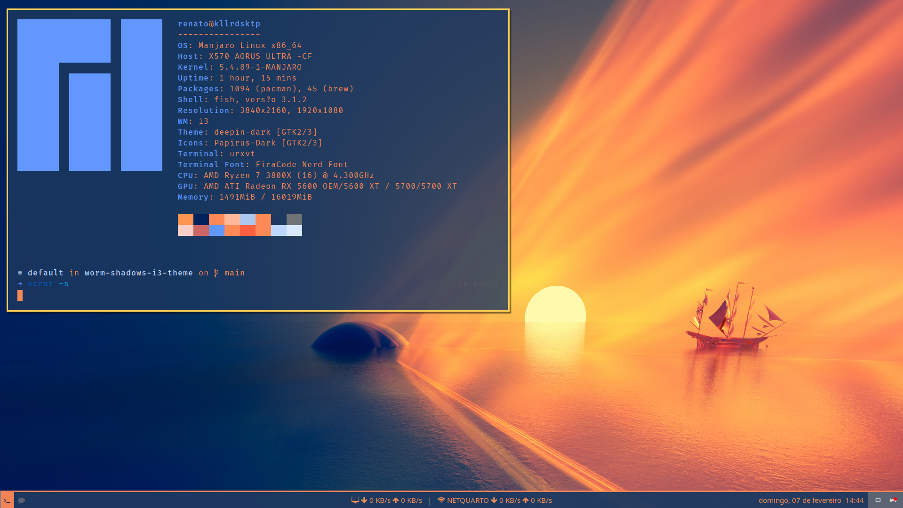

# Worm Shadows i3 Theme
This repository contains the dotfiles for the i3 Theme `Worm Shadows`, created by me based on the picture of wallpaper, that was created by: [HaKhalifa](https://www.deviantart.com/hakhalifa) and posted on Deviantart: [WormShadows](https://www.deviantart.com/hakhalifa/art/Worm-Shadows-869187612)

## Requirements
- [i3-gaps](https://github.com/Airblader/i3)
- [polybar](https://github.com/polybar/polybar)
- [urxvt](https://www.linuxlinks.com/urxvt/)
- [starship](https://starship.rs)
- [fish shell](https://fishshell.com/)
- [rofi](https://github.com/davatorium/rofi)
- [oh my fish](https://github.com/oh-my-fish/oh-my-fish)

## Installation
All you have to do is to put all these files and folders in the dir: `$HOME/.config`

## Credits
- [HaKhalifa](https://www.deviantart.com/hakhalifa) for this awesome wallpaper
- @nuxlli For the awesome `fishcognito` approach and all the explains about how works Fish and Starship